<div align="center">

<a href="https://sujan-space.vercel.app/">
  
</a>

</div>

<div align="center">

[](https://sujan-space.vercel.app/)

</div>

<div align="center">

[](https://github.com/KRYSTALM7)
[](https://github.com/KRYSTALM7?tab=followers)
[](https://github.com/KRYSTALM7)
[](https://github.com/Dijkstra-Edu)

</div>

---

## `whoami`

```yaml
┌─────────────────────────────────────────────────────────────────┐
│                                                                 │
│  name         : Sujan Kumar MV                                  │
│  alias        : KRYSTALM7                                       │
│  role         : Backend Engineer @ Tata Consultancy Services    │
│  education    : M.Tech CS — VIT Vellore (GPA: 8.21/10)          │
│  location     : Hyderabad, India                                │
│  focus        : Distributed Systems · AI/ML · Cloud · GSoC      │
│  published_in : Springer · Nature Portfolio · IET Book Chapter  │
│  at_work      : Modernizing legacy COBOL → Java/Spring Boot     │
│  fun_fact     : I build systems that talk                       │
│                                                                 │
└─────────────────────────────────────────────────────────────────┘
```

## `connect`

<div align="center">

[](https://www.linkedin.com/in/sujankumar2003/)
[](https://sujan-space.vercel.app/)
[](mailto:sujankumar7702@gmail.com)
[](https://www.researchgate.net/)
[](https://twitter.com/SujanKu73358229)

</div>

---

## 🏅 Certifications

<p align="center">

<a href="https://learn.microsoft.com/api/credentials/share/en-in/SujanKumar/22D2CA451EE76194?sharingId=8E5A85C7BA5D50FE">

</a>

<a href="https://learn.microsoft.com/api/credentials/share/en-in/SujanKumar/766CC0693F2030C7?sharingId=8E5A85C7BA5D50FE">
  
</a>

<a href="https://learn.microsoft.com/api/credentials/share/en-in/SujanKumar/A42AC9279AE55E5?sharingId=8E5A85C7BA5D50FE">

</a>

<a href="https://www.mlsummerschool.com/">

</a>

</p>

---

## Research & Publications

| # | Title | Venue | Year |
|---|---|---|---|
| 01 | [Optimizing Charge–Discharge Cycles Using QPPONet-Enabled Hybrid Learning Framework for Energy Management and Safety in Electric Vehicles](https://www.nature.com/srep/) | Scientific Reports *(Nature Portfolio)* · Q1 · IF ~3.9 · Accepted | 2026 |
| 02 | [Energy Optimization in EV Battery Management Systems — RL + ML hybrid framework](http://icsper.in/) | ICSPER *(Accepted · To be Published via Springer)* | 2025 |
| 03 | [Generative AI for Brain Tumor Detection — GAN + CNN (VGG16, ResNet50)](https://digital-library.theiet.org/doi/abs/10.1049/PBPC076E_ch6) | IET Book Chapter · *Generative AI Unleashed* | 2024 |
| 04 | [Fake News Integrity via LSTM + XGBoost — 92.4% on LIAR dataset](https://www.taylorfrancis.com/chapters/edit/10.1201/9781003498094-9/enhancing-knowledge-management-integrity-fake-news-detection-sujan-kumar-ganesh-khekare-anurup-sankriti) | CKM 2024 · *Cybersecurity in Knowledge Management* | 2024 |

---

## Languages

<p align="left">


</p>

---

## Tools & Frameworks

<p align="left">


</p>

---

## 📊 GitHub Dashboard

<table>
  <tr>
    <td valign="top" width="50%">
      <a href="https://metrics.lecoq.io/insights/KRYSTALM7">
        
      </a>
    </td>
    <td valign="top" width="50%">
      <a href="https://metrics.lecoq.io/insights/KRYSTALM7">
        
      </a>
    </td>
  </tr>
</table>

---

## 🧩 LeetCode Stats

<div align="center">
  <a href="https://metrics.lecoq.io/insights/KRYSTALM7">
    
  </a>
</div>

---

<div align="center">

<a href="https://sujan-space.vercel.app/">
  
</a>

</div>
